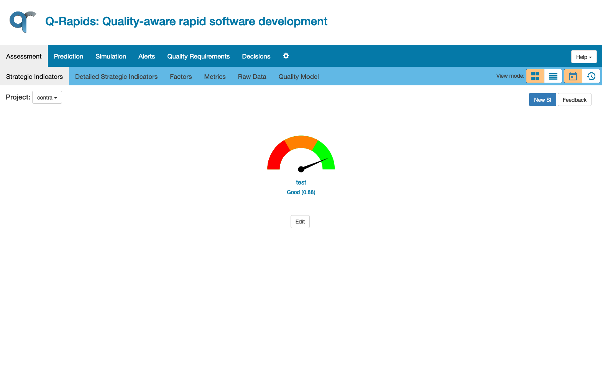

# Q-Rapids: Quality-aware rapid software development

Repository with general information about Q-Rapids H2020 project and the software components produced. The aim of the project is produce an evidence-based, data-driven quality-aware rapid software development method where quality requirements are incrementally elicited, refined and improved based on data gathered from software repositories, management tools, system usage and quality of service. This data is analysed and aggregated into quality-related strategic indicators which are presented in a highly informative dashboard.


This project has received funding from the European Union’s Horizon 2020 research and innovation programme under grant agreement No 732253.

# Build images

Go to the main directory where the docker-compose file is located and follow the instruction

```bash
docker-compose build
```
Please notice that this make take some time to finish.

The used images are available at [DockerHub](https://hub.docker.com/u/qrapids).
# Quick Start

After building all images, we can set up the entire environment including PostgresSQL, Sonarcube, Elasticsearch, Kafka, and Zookeeper

```bash
# Running required tools
docker-compose up -d sonarqube zookeeper kafka elasticsearch kibana db
```
Verify all services have been started correctly. In the next step, we need to add an example project to analyse it with Sonarcube. This step is needed to produce the minimum amount of data for Q-Rapids tools. 

```bash
# Add Example project into SonarCube
docker-compose up sample-projects
```

When we adding example project into Sonarcube we have to run  qrconnect_sonar, dashboard rbase,  qralert, siassessment-rest  
 
```bash
docker-compose up -d qrconnect_sonar pabrews dashboard rbase qralert siassessment-rest  forecast-rest
```

**Important** It will take some time to start the Rbase component for the first time. This is due to the dependencies that need to be downloaded and compiled. Please wait until this process is finished. Afterwards, continue with the following command:


```bash
docker-compose up -d  qreval
```


The main page view, available on the port 8080: 



# Exposed ports

* Dashboard port: 8080
* Sonarqube port: 4875
* Kibana port: 5601
* Elasticsearch port: 9200, 9300
* Qralert port : 5051
* Rbase port : 6311


# Documentation

You can find all the information you need in this repository [Wiki](https://github.com/q-rapids/q-rapids/wiki).


# Contributing
See the Q-Rapids Contribution Guidelines [here](https://github.com/q-rapids/q-rapids/blob/master/CONTRIBUTING.md).
